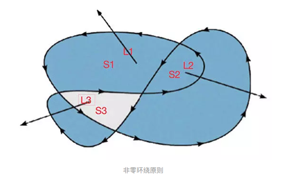

# 非零环绕原则

## 定义

非零环绕规则是图形学中**判断**某个区域是在**所属区域外面还是内部**的一种规则。

对于路径中的任意给定区域，从该区域内部画一条足够长的线段，使此线段的终点完全露在路径范围之外。然后将计数器初始化为0，每当这条线段与路径上的直线或曲线相交时，就改变计数器的值。**如果与路径顺时针部分相交的时候，则加1**；**如果与路径的逆时针部分相交的时候，则减1**。如果最终值不是0，那么说明区域在路径的里面



如图所示

+ S1区域：L1线段相交计数为1，在路径里面
+ S2区域：L2线段相交数为2，在路径里面
+ S3区域：L3线段相交数为0（顺时针+1，逆时针-1），在路径外面

## Demo

给定一张图片，裁剪这张图片使中心露出一个透明的圆形

### 思路

+ 先顺时针画一条矩形裁剪路径，裁剪全部图片
+ 再逆时针画一条圆形裁剪路径，裁剪中间

根据非零环绕原则，中间的圆形区域不在裁剪路径内，不会被图片填充

### SVG版实现

```html
<svg width="300px" height="300px">
  <clipPath id="cut-off">
    <!-- 顺时针裁减个方，然后逆时针裁减个圆 -->
    <path d="
              M 0,0 
              H 300 
              V 300
              H 0
              Z

              M 150,100
              A 50 50 0 1 0 150 200
              M 150,200
              A 50 50 0 1 0 150 100
              " />
  </clipPath>
  <image xlink:href="xxx.jpg" clip-path="url(#cut-off)" width="300px" height="300px" />
</svg>
```

### Canvas版实现

```html
<canvas id="canvas" width="300px" height="300px" />
<script>
  const canvas = document.querySelector('#canvas');
  const ctx = canvas.getContext('2d');
  const img = document.createElement('img');
  img.style.height = '300px'
  img.style.width = '300px'
  img.src = './20201206175253.jpg';
  img.onload = function() {
    ctx.beginPath();
    ctx.rect(0, 0, 300, 300)    // 矩形路径
    ctx.arc(150, 150, 50, 0, 2 * Math.PI, true);  // 逆时针圆形路径
    ctx.closePath();
    ctx.clip();   // 裁剪路径
    ctx.drawImage(img, 0, 0, 300, 300);
  }
</script>
```

## 扩展

> [奇偶环绕原则](https://en.wikipedia.org/wiki/Even%E2%80%93odd_rule)